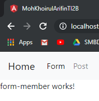

**TUGAS PERORANGAN/INDIVIDU**

**LAPORAN BAB 10**

**ROUTING DAN NAVIGASI**

**Disusun Sebagai:**

MATA KULIAH: PEMROGRAMAN WEB LANJUT

**Oleh:**

**Moh. Khoirul Arifin/1741720051**

**TI-2B**

**PROGRAM STUDI D-IV TEKNIK INFORMATIKA**

**JURUSAN TEKNOLOGI INFORMASI**

**POLITEKNIK NEGERI MALANG**

**2019**

**Praktikum – Bagian 1: Configure the routes**

1.  Buat project baru yang berisi komponen posts (praktikum http service),
    form-member (soal uts), navbar, not-found, home

    

2.  Jika node_modules belum tersida, install menggunakan **npm install**

3.  Buka file app.module.ts. Pastikan komponen pada langkah 1 sudah terdaftar
    seperti gambar dibawah ini

    

4.  Tambahkan module router pada halaman app.module.ts seperti gambar dibawah
    ini:

    

5.  Buka halaman navbar.component.html dan tambahkan kode dibawah ini:

    

6.  Buka halaman app.component.html. tambahkan kode dibawah ini:

    

7.  Jalankan dan catat hasilnya (soal no. 1)

    

    

**Praktikum - Bagian 2 : Router Outlet**

1.  Buka halaman app.component.html dan rubah menjadi seperti dibawah ini:

    

2.  Jalankan dan inspect elemen seperti pada gambar dibawah ini

    

    

    Apa yang bisa anda simpulkan? (Soal No 2)

3.  Jalankan link dibawah ini localhost:4200/form seperti gambar dibawah ini:

    

    

    catat hasilnya (Soaln No. 3)

4.  Jalankan link dibawah ini localhost:4200/post seperti gambar dibawah ini:

    

    

    catat hasilnya (Soaln No. 4)

5.  Jalankan link dibawah ini localhost:4200/coba seperti gambar dibawah ini:

    

    

    catat hasilnya (Soaln No. 5)

6.  SImpulkan langkah 3, 4 dan 5 (Soal No. 6)

**Praktikum - Bagian 3 : Add Link**

1.  Buka halaman navbar.component.html. tambahkan link pada href tiap menu
    seperti gambar dibawah ini:

    

2.  Jalankan, catat dan berikan penjelasan (Soal No. 7)

    

    

    

3.  Modifikasi href menjadi routerLink pada halaman navbar.component.html
    seperti gambar dibawah ini:

    

4.  Jalankan, inspect element, coba link dan cek pada tab network. Catat dan
    beri penjelasan (Soal No. 8)

    

    

    

5.  Modifikasi class li pada halaman navbar.component.html menjadi seperti pada
    gambar dibawah ini:

    

6.  Jalankan, catat dan beri penjelasan (Soal No. 9)

    

    

    

**Praktikum - Bagian 4 : Accesing Route Parameter**

1.  Buat komponen baru dengan nama profile dengan perintah **ng g c profile**

    

    

2.  Buka app.module.ts dan tambahkan route untuk profile seperti gambar dibawah
    ini:

    

3.  Modifikasi halaman [home.component.html](http://home.component.html) menjadi
    seperti gambar dibawah ini:

    

4.  Modifikasi file profile.component.ts menjadi seperti pada gambar dibawah
    ini:

    

5.  Jalankan, klik tombol home kemudian kliklink joko bowo kemudia inspect
    element seperti dibawah ini:

    

    

    Catat dan berikan penjelasan (Soal No. 10)

6.  Modifikasi file profile.component.ts menjadi seperti pada gambar dibawah
    ini:

    

7.  Jalankan, klik tombol home kemudian klik link joko bowo kemudia inspect
    element. Catat dan berikan penjelasan (Soaln No. 11)

    
