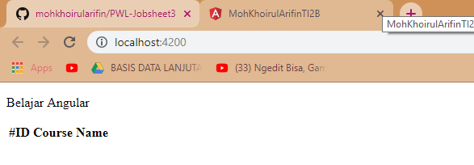

**TUGAS PERORANGAN/INDIVIDU**


**LAPORAN JOBSHEET 3**

**Angular Fundamental**


**Disusun Sebagai:**

MATA KULIAH: PEMROGRAMAN WEB LANJUT


**Oleh:**

**Moh. Khoirul Arifin/1741720051**

**TI-2B**


**PROGRAM STUDI D-IV TEKNIK INFORMATIKA**

**JURUSAN TEKNOLOGI INFORMASI**

**POLITEKNIK NEGERI MALANG**

**2019**


### Praktikum – Bagian 1: Component Basic
- Soal 1
Buatlah sebuah componen dengan nama **courses** dengan cara `ng generate component name atau ng g c name`


- Buka file **app.component.html**, lakukan modifikasi code nya menjadi seperti berikut :

```html
<app-courses></app-courses>

<router-outlet></router-outlet>
```

- Kemudian open terminal dan jalan kan perintah ng serve, lalu perhatikan pada browser

- Soal 2
hasilnya


- Buka file app.modules.ts dan hapus coursecomponent pada declarations


- Soal 3
Hasil pada browser


- Soal 4
Kemudian lakukan inspect pada halaman localhost : 4200 di browser, apa yang terlihat? Berikan penjelasan


### Praktikum - Bagian 2: Templates

- Buka file courses.component.ts tambahkan property baru dengan nama title

- Soal 5
Hasil


-Tambahkan string pada binding datanya. Buka file courses.component.html. 

- Soal 6
Hasil


- Buka file courses.component.ts dan buatlah sebuah method dengan nama getTitle

- Kemudian buka file courses.component.html, lakukan modifikasi 

- Soal 7
Hasil


### Praktikum - Bagian 3: Types
- Buka file courses.component.ts dan buat property dengan nama course dengan data berupa array

- Buka file courses.component.html lalu tambahkan directive ngFor dan string interpolation

- Soal 8
Hasil


- Buatlah service baru yang bernama **courses** dengan perintah : `ng generate service courses` atau `ng g s courses`

- Soal 9
Hasil


- Buka file courses.service.ts kemudian tambahkan method getCourse

- Buka file courses.component.ts, kemudikan lakukan modifikasi codenya

- Soal 10
Hasil



- Tambahkan constructor

- Soal 11
Hasil


