** TUGAS PERORANGAN/INDIVIDU **

** LAPORAN JOBSHEET 4 **

** Displaying Data And Handling Events **

** Disusun Sebagai: **

MATA KULIAH: PEMROGRAMAN WEB LANJUT

** Oleh: **

** Moh. Khoirul Arifin/1741720051 **

** TI-2B **

** PROGRAM STUDI D-IV TEKNIK INFORMATIKA **

** JURUSAN TEKNOLOGI INFORMASI **

** POLITEKNIK NEGERI MALANG **

** 2019 **

### Praktikum – Bagian 1: Component Basic
- Buka file course.component.ts tambahkan code

- Buka file course.component.html tambahkan code

- Soal 1
Hasil
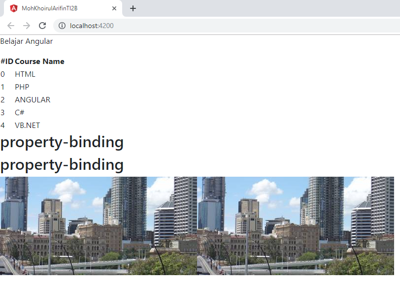

### Praktikum – Bagian 2: Attribute Binding
- Buka file courses.component.ts tambahkan property colspan dibawah line imageUrl.

- Buka file courses.component.html dan tambahkan Code

- Buka browser kemudian lakukan inspect maka akan muncul error

- Tambahkan attr pada colspan

- Soal 2
Hasil
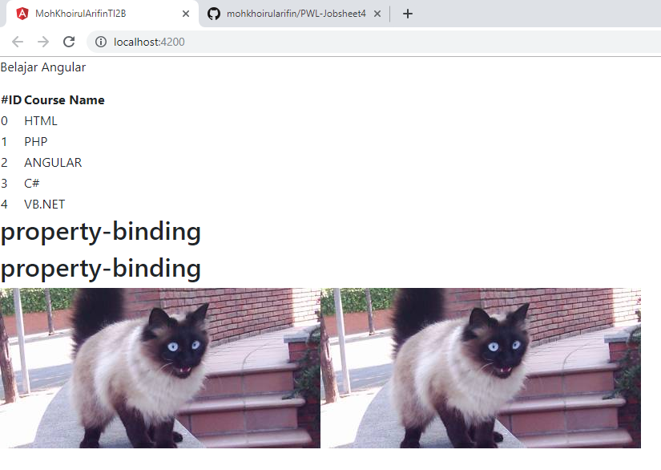

- Selanjutnya tambahkan button pada courses.component.html

- Soal 3
Hasil
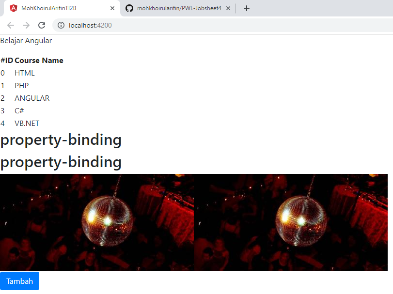

### Praktikum – Bagian 3: Class Binding
- Buka file courses.component.ts dan tambahkan property isActive = true setelah line colspan = 2;

- Buka file courses.component.html lalu tambahkan class binding

- Rubah isActive menjadi false dan inspect element maka kondisi active akan hilang

### Praktikum – Bagian 4: Style Binding
- Buka file courses.component.html kemudian tambahkan code

- Soal 4
Hasil
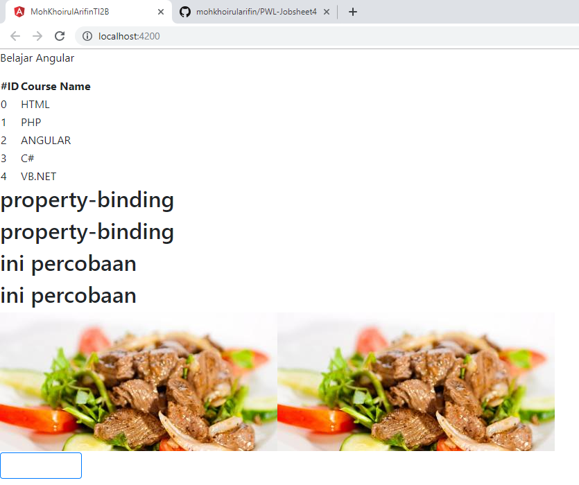

### Praktikum – Bagian 5: Event Binding
- Buka file course.component.ts dan buatlah method dengan nama onSave()

- Buka file courses.component.html dan tambahkan event click

- Jalankan localhost:4200 dan lakukan inspect element. Jika button di click maka pada console akan muncul keterangan button sudah di klik
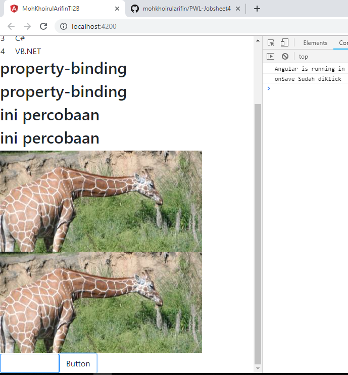

- Buka file courses.component.ts tambahkan parameter $event

- Tambahkan juga pada courses.component.html

- Soal 5
Hasil
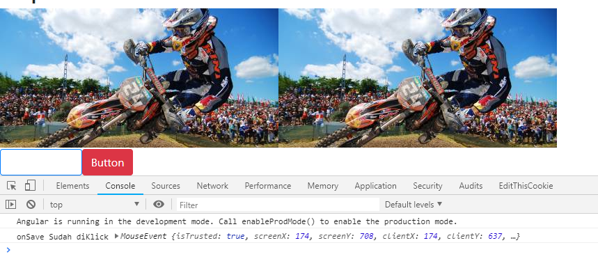

- Buatlah method onDivClick() pada courses.component.ts

- Tambahkan div dan event binding pada div elemen

- Soal 6
Hasil
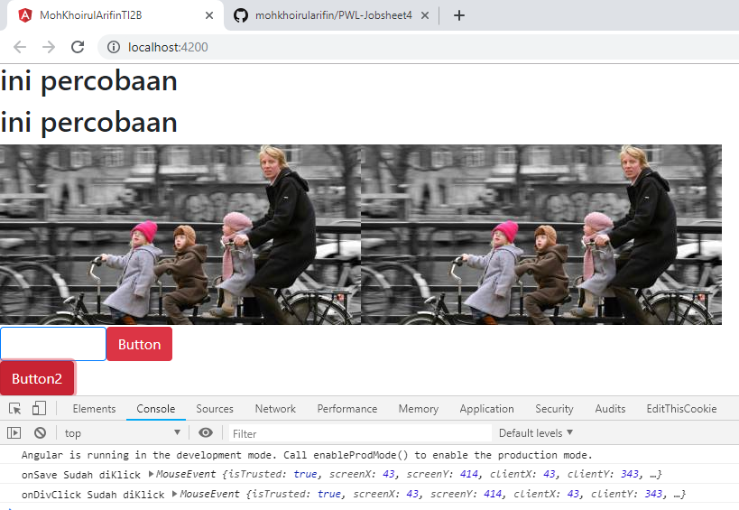

- Untuk mengatasi event bubbling maka tambahkan $event.stopPropagation pada courses.component.ts

- Soal 7
Hasil
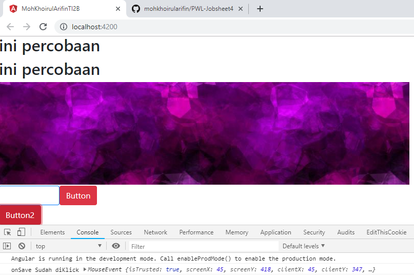

### Praktikum – Bagian 6: Event Filtering
- Buat inputan pada courses.component.html

- Tambahkan method onKeyUp

- Soal 8 Jalankan localhost, kemudian isikan sesuatu pada kolom inputan yang sudah dibuat dan lakukan inspect elemen. Perhatikan pada console
Hasil
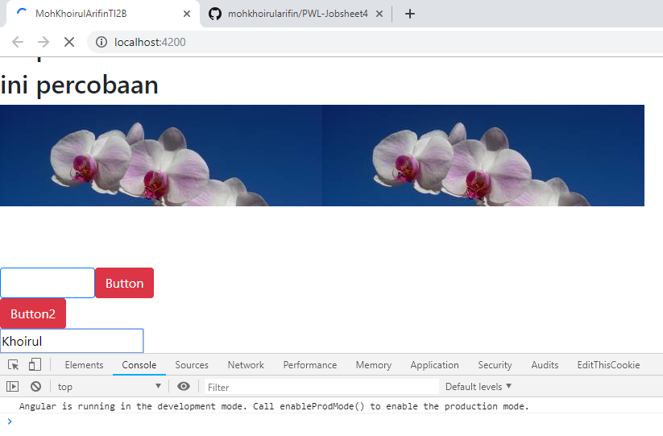

- Soal 9 Kemudian bandingkan apabila button enter ditekan
Hasil
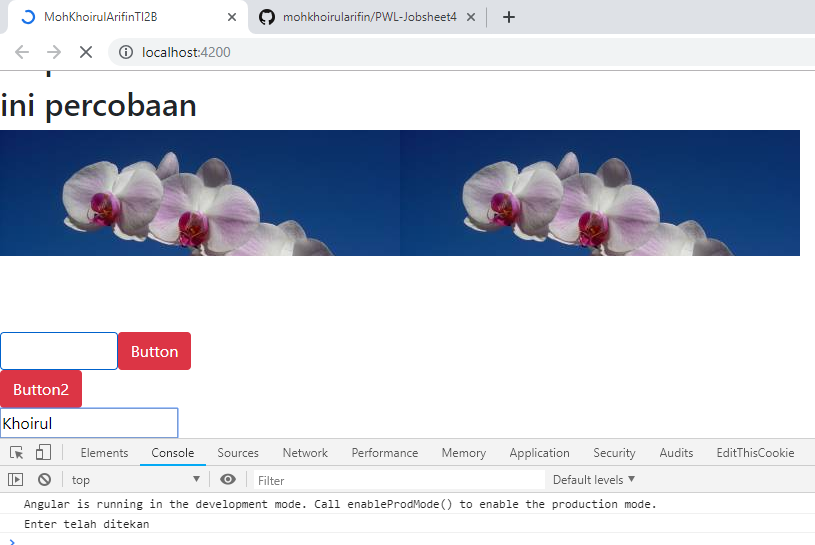

### Praktikum – Bagian 7: Template Variable
- Tambahkan variabel #nama pada courses.component.html

- Tambahkan parameter nama pada method onKeyUp

- Soal 10 Perhatikan apa yang terjadi ketika kita beri inputan? Cek pada inspect element dan lihat di console.
Hasil
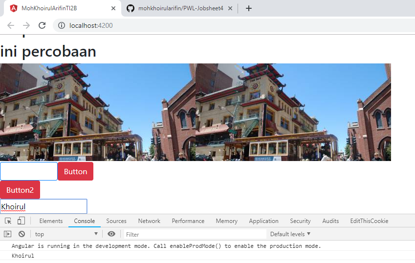

### Praktikum – Bagian 8: Two Way Binding
- Buat property baru dengan nama kalian masing-masing dan rubah parameter pada log

- Tambahkan parameter nama pada method onKeyUp

- Soal 11 Perhatikan apa yang terjadi pada kolom inputan? Cek pada inspect element dan lihat di console.
Hasil
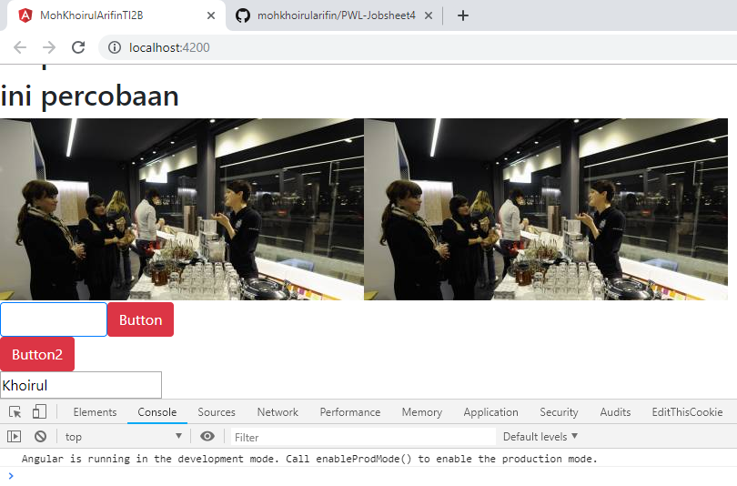

- Buka app.module.ts dan tambahkan formmodule

- Buka course.component.html, modifikasi code

- Soal 12 Perhatikan apa yang terjadi pada kolom inputan? Cek pada inspect element dan lihat di console.
Hasil
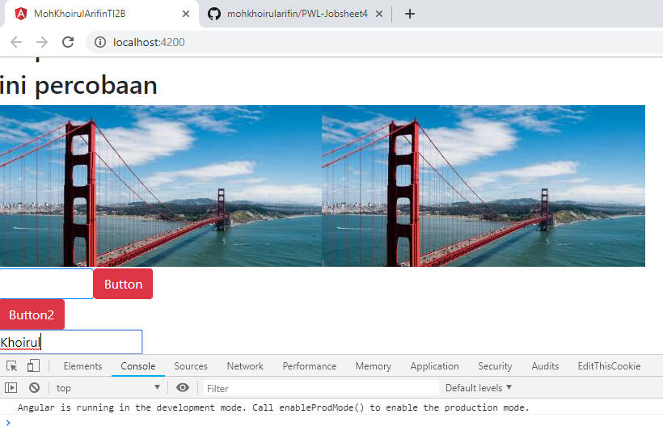

